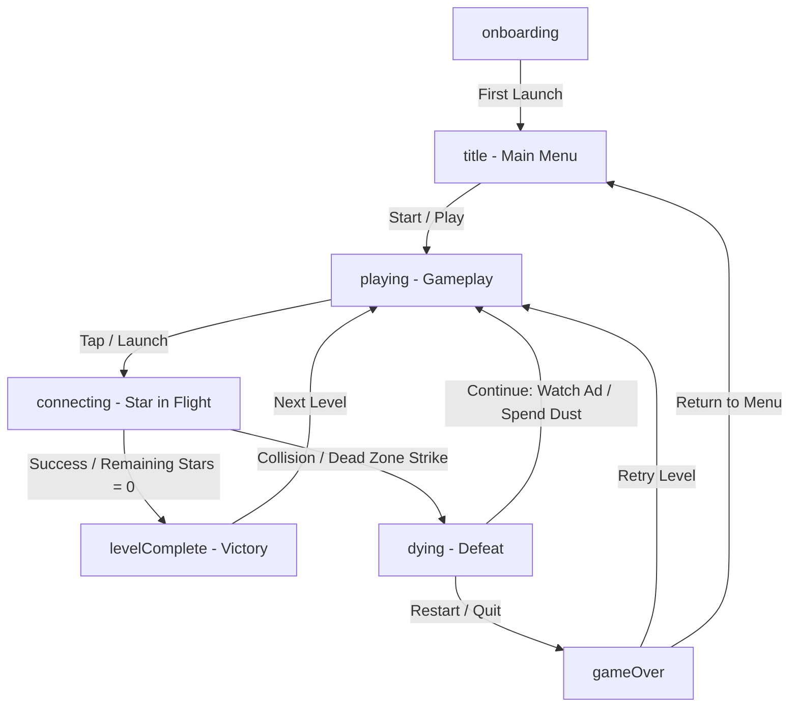

# ✦ Constella ✦

[](https://flutter.dev)
[](https://flame-engine.org)
[](#)
[](#)

> **Constella** is a visually stunning, retro-modern, constellation-themed casual arcade game where you launch and connect stars to form beautiful constellations.

Built using Flutter and the Flame game engine, Constella reinvents the classic *aa*-style timing mechanics by introducing cosmic themes, dynamic difficulty modifiers, and a rich progression system.

---

## 🌌 Core Gameplay & Mechanics

Constella features a progressive learning curve that starts simple and builds up to complex, multi-layered challenges:

*   **Launch & Pin:** Tap the screen to shoot stars and pin them onto the spinning center core. Make sure stars do not touch each other!
*   **Color Matching Mode:** In color-themed levels, the core is split into colored slices. You must pin each star onto the slice with the matching color.
*   **Cosmic Dust (Dead Zones):** Red forbidden areas rotate along the core. Pinning a star onto these zones causes an explosion and failure.
*   **Dynamic Core Behaviors:**
    *   *Radius Pulse:* The core expands and shrinks rhythmically, constantly changing your timing window.
    *   *Direction Flip:* The core suddenly reverses its rotational direction after a certain number of turns.
    *   *Jolt:* Pinned stars or sudden space tremors cause the core to shake unexpectedly.
*   **Boss Levels:** Face intense challenges where multiple mechanics combine to test your reflexes.

---

## ✨ Key Features

*   **Stardust & Customization Shop:** Earn *stardust* by clearing levels and spend it in the shop to unlock gorgeous cosmetic skins and cores.
    *   **Star Skins:** Classic, Diamond, Emerald, Nova, Comet.
    *   **Core Themes:** Classic, Ember, Amethyst, Jade, Frost.
*   **Daily Quests & Streaks:** Complete daily challenges (e.g., clear 5 levels, get 3 near misses) to gain extra stardust and build login streaks.
*   **Multi-language Support:** Localized in 9 languages:
    *   English, Turkish, Spanish, Portuguese, French, German, Russian, Italian, and Indonesian.
*   **Monetization & Ads:**
    *   Google Mobile Ads integration (Banner and Rewarded/Interstitial ads).
    *   A *Continue* system allowing players to watch an ad or spend stardust to resume after failing.
    *   Premium features like "Remove Ads", "Skip Level", and **God Mode** (unlimited skips & ad-free).

---

## 🛠️ Technology Stack

*   **Flutter (SDK ^3.11.4):** Cross-platform UI structure and lifecycle handling.
*   **Flame (^1.37.0):** High-performance 2D game engine managing components and rendering.
*   **Flame Audio (^2.12.1):** Latency-free background music and sound effects.
*   **Shared Preferences (^2.5.5):** Local data persistence for scores, levels, stardust, and unlocked cosmetics.
*   **Google Mobile Ads (^9.0.0):** Mobile monetization.
*   **App Tracking Transparency (^2.0.7):** iOS compliance for ad tracking authorization.

---

## 📂 Project Structure

```
lib/
├── main.dart            # App entry point, ad setup, and core MaterialApp structure.
├── game.dart            # Flame Game loop, physics, collisions, and gameplay rules.
├── level_config.dart    # Algorithmic/deterministic level generation and difficulty scaling.
├── overlays.dart        # Flutter-based overlay menus (shop, settings, quests, HUD).
├── strings.dart         # Localization database supporting 9 languages.
└── ads.dart             # Ad service configurations.
```

---

## 🔄 Game State Flow

The state machine transitions of the Flame game loop are mapped as follows:



---

## 🚀 Getting Started

To run the project locally on your machine, follow these steps:

1.  **Prerequisites:**
    *   Flutter SDK (v3.11.4 or higher)
    *   An IDE (VS Code or Android Studio) with Flutter extensions

2.  **Clone the Repository:**
    ```bash
    git clone https://github.com/dogukandoymaz/constella.git
    cd constella
    ```

3.  **Fetch Dependencies:**
    ```bash
    flutter pub get
    ```

4.  **Run the App:**
    ```bash
    # Ensure you have a simulator or a physical device connected
    flutter run
    ```

---

## 🌌 Contributing

1. Fork the Project.
2. Create your Feature Branch (`git checkout -b feature/AmazingFeature`).
3. Commit your Changes (`git commit -m 'Add some AmazingFeature'`).
4. Push to the Branch (`git push origin feature/AmazingFeature`).
5. Open a Pull Request.

---

*Constella brings the silence and beauty of the night sky to your fingertips. Connect the stars and create your own universe! ✦*
