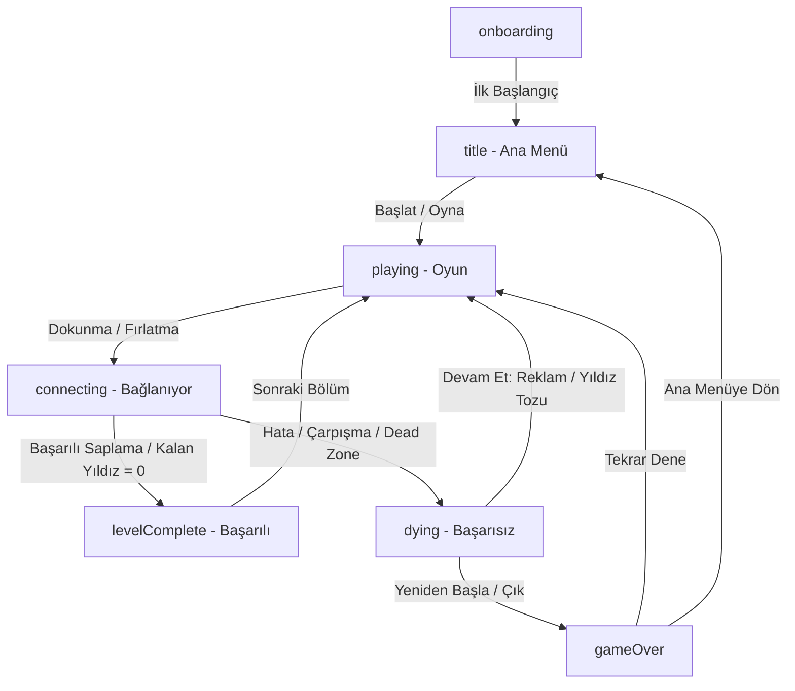

# ✦ Constella ✦

[](https://flutter.dev)
[](https://flame-engine.org)
[](#)
[](#)

> **Constella**, gökyüzündeki yıldızları birbirine bağlayarak büyüleyici takımyıldızlar oluşturduğunuz, retro-modern estetiğe sahip, sakinleştirici ama bir o kadar da zorlayıcı bir mobil arcade oyunudur. 

Flutter ve Flame oyun motoru kullanılarak geliştirilen Constella, klasik *aa* tarzı zamanlama mekaniklerini kozmik bir tema, dinamik zorluk faktörleri ve zengin bir ilerleme sistemiyle birleştirir.

---

## 🌌 Temel Oynanış ve Mekanikler

Constella, basit dokunuşlarla başlayan ancak seviye ilerledikçe derinleşen dinamik bir zorluk eğrisine sahiptir:

*   **Fırlat ve Sapla:** Ekrana dokunarak alt kısımdaki yıldızları merkezde dönen çekirdeğe (core) fırlatın. Yıldızların birbirine çarpmamasına dikkat edin!
*   **Renk Eşleştirme Modu (Color Mode):** Bazı seviyelerde çekirdek renkli dilimlere bölünmüştür. Yıldızları yalnızca kendi rengindeki dilime saplamalısınız.
*   **Kozmik Toz Bulutları (Dead Zones):** Çekirdek üzerinde dönen kırmızı renkli yasaklı bölgeler yer alır. Yıldızlarınızı bu bölgelere saplarsanız çekirdek patlar ve başarısız olursunuz.
*   **Dinamik Çekirdek Hareketleri:**
    *   *Nefes Alma (Radius Pulse):* Çekirdek ritmik olarak büyüyüp küçülür, saplama zamanlamanızı zorlaştırır.
    *   *Yön Değiştirme (Flip):* Çekirdek belirli turlardan sonra aniden dönüş yönünü tersine çevirir.
    *   *Sarsıntı (Jolt):* Yıldız saplandığında veya rastgele anlarda çekirdek ani sarsıntılar yaşar.
*   **Boss Seviyeleri:** Belirli aralıklarla gelen boss seviyelerinde tüm bu zorlu mekanikler bir araya gelerek reflekslerinizi test eder.

---

## ✨ Özellikler

*   **Yıldız Tozu (Stardust) & Kozmetik Mağazası:** Bölümleri tamamlayarak kazandığınız yıldız tozlarıyla mağazadan yeni yıldız görünümleri (Skins) ve çekirdek temaları (Cores) satın alabilirsiniz.
    *   **Yıldız Görünümleri:** Klasik, Elmas, Zümrüt, Nova, Kuyruklu Yıldız.
    *   **Çekirdek Temaları:** Klasik, Kor, Ametist, Yeşim, Buz.
*   **Günlük Görevler (Daily Quests):** Her gün yenilenen hedefleri (örn: 5 seviye geç, 3 kıl payı kaçış yap) tamamlayarak ekstra yıldız tozu kazanın.
*   **Giriş Serileri (Streaks):** Oyuna her gün kesintisiz giriş yaparak günlük ödüllerinizi katlayın.
*   **Çoklu Dil Desteği:** 9 farklı yerelleştirilmiş dil seçeneği:
    *   Türkçe, İngilizce, İspanyolca, Portekizce, Fransızca, Almanca, Rusça, İtalyanca ve Endonezyaca.
*   **Monetization & Reklam:**
    *   Google Mobile Ads entegrasyonu (Banner ve Ödüllü/Geçiş reklamları).
    *   Kullanıcıların başarısız olduğunda reklam izleyerek veya yıldız tozu harcayarak kaldığı yerden devam edebilmesini sağlayan *Continue* mekanizması.
    *   Reklamları kaldırma, bölüm atlama veya tüm seviyeleri serbestçe açan **God Mode** desteği.

---

## 🛠️ Teknoloji Yığını (Tech Stack)

*   **Flutter (SDK ^3.11.4):** Çapraz platform arayüz ve yaşam döngüsü yönetimi.
*   **Flame (^1.37.0):** Oyun döngüsü (game loop), bileşenler (components) ve render işlemleri.
*   **Flame Audio (^2.12.1):** Arka plan müzikleri ve ses efektlerinin gecikmesiz çalınması.
*   **Shared Preferences (^2.5.5):** Skorlar, seviye ilerlemeleri, stardust bakiyesi ve satın alınan mağaza ögelerinin cihazda güvenli saklanması.
*   **Google Mobile Ads (^9.0.0):** Reklam yönetimi.
*   **App Tracking Transparency (^2.0.7):** iOS kullanıcıları için ATT izin penceresi entegrasyonu.

---

## 📂 Proje Yapısı

```
lib/
├── main.dart            # Uygulama başlangıcı, reklam yüklemeleri ve ana widget ağacı.
├── game.dart            # Flame Game döngüsü, fizik motoru ve oyun içi mekanikler.
├── level_config.dart    # Algoritmik/deterministik seviye üretim motoru ve zorluk bütçesi.
├── overlays.dart        # Flutter tabanlı menüler, mağaza, ayarlar ve HUD ekranları.
├── strings.dart         # 9 dilli yerelleştirme (localization) veri tabanı.
└── ads.dart             # Google Mobile Ads servis yapılandırması.
```

---

## 🔄 Oyun Durum Akışı (Game Loop)

Aşağıdaki şemada oyunun Flame tabanlı durum geçişleri gösterilmiştir:



---

## 🚀 Başlangıç (Getting Started)

Projeyi yerel makinenizde çalıştırmak için aşağıdaki adımları takip edebilirsiniz:

1.  **Gereksinimler:**
    *   Flutter SDK (v3.11.4 veya üzeri)
    *   Uyumlu bir IDE (VS Code veya Android Studio)

2.  **Projeyi Klonlayın:**
    ```bash
    git clone https://github.com/kullanici_adi/constella.git
    cd constella
    ```

3.  **Bağımlılıkları Yükleyin:**
    ```bash
    flutter pub get
    ```

4.  **Uygulamayı Çalıştırın:**
    ```bash
    # Android veya iOS simülatörünüzün/cihazınızın bağlı olduğundan emin olun
    flutter run
    ```

---

## 🌌 Katkıda Bulunma (Contributing)

1. Bu projeyi fork edin.
2. Yeni bir özellik dalı (branch) oluşturun: `git checkout -b yeni-ozellik`
3. Değişikliklerinizi taahhüt edin (commit): `git commit -am 'Yeni özellik eklendi'`
4. Dalı yukarı itin (push): `git push origin yeni-ozellik`
5. Bir Pull Request oluşturun.

---

*Constella, gökyüzünün sessizliğini parmaklarınızın ucuna getirir. Yıldızları birleştirin ve kendi takımyıldızınızı yaratın! ✦*
